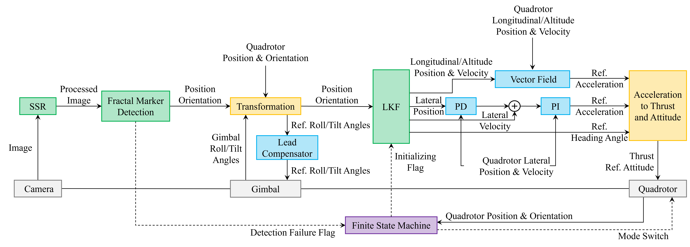

# Vector Field-Based Robust Quadrotor Landing on a Moving Ground Platform

## Description

This ros package was used to the robust quadrotor landing and computed in Nvidia Jetson Xavier NX. 
This contains not only sources related to landing, but also related to tracking such as tuning method for the position control (PD) and velocity control (PID or PI).
Furthermore, it provides the fractal marker ground platform which can be controlled by gv_ctrl.py in the gazebo simulation.  

## System Architecture




## Fractal Marker Issue
- In Jetson, the error of segmentation fault (core dumped) can occur. I'd resolved it following step:
1. check `make clean <package_name>` or `make clean --all` and rebuild your package.
2. check your CMakeLists and Location of ArUco libs.
3. First, install following `sudo apt-get update && sudo apt-get install ros-noetic-aruco-ros` If you need, install manually.
4. Check your source code. In Jetson, do not use VideoCapture instance and FractalDetector instance together. It caused the OpenCV error and segmentation fault.


**Note:** The fun thing is that the unified code which are contained the videocapture and fractal detection is slower than seperated code in Jetson platform.


## Position/Velocity  Control Tuning
- ./aims_start.sh ctrl_tuning.yml
ctrl_tuning.yml will use the controller.launch and setpoint.launch. (safety.launch is the option)


### Position(PD) and Velocity(PI) Controller Gain Tuning
**Starting Command:**
```
./aims_start.sh gain_tuning.yml
```
**Guideline:**

1. First, do not change the mode to Offboard until find out the hover thrust scale and write in the controller.launch file. You can find out it from the ```/mavros/setpoint_raw/target_attitude``` ROS topic.

2. Modify the launch files:
    - Velocity tuning:
        - In the gain_tuner.launch, modify the ```tuning_what:=velocity```, ```tuning_axis:=x``` which axis is the desired_axis in world frame and ```head_setpoint:=0``` of which degree is the desired head angle in world frame. If inner loop of your vehicle is well tuned, then you can set the same gains of position and velocity controller to roll and pitch axes.
        - You can adjust the step input size and duration by modifying the ```step_input_size``` and ```step_duration``` parameters.

    - Position tuning:
        -  In the gain_tuner.launch, modify the ```tuning_what:=position```. Other parameters are as same role in velocity tuning. So, freely modify them if you want.
        - In the controller.launch, modify the ```with_position:=true``` parameter.

3. Experiment steps:
    - Velocity tuning:
        1. Insure the hover thrust parameter is right in the controller.launch file.
        2. Follow the (2. Modify the launch files) section.
        3. In the controller.launch, modify the velocity gain parameters and integral term, thrust min/max, tilt max parameters if you need to edit. 
        4. Take-off the vehicle in RC controller, and stay it stable hover flight.
        5. Change the flight mode to Offboard with your RC or QGC.
        6. UAV will reach some step signal.
        7. Performance metrices and some information of tuning will be recored in results.txt.
    
    - Position tuning:
        1. Insure the hover thrust parameter is right in the controller.launch file.
        2. Follow the (2. Modify the launch files) section.
        3. In the controller.launch, modify the position gain parameters and velocity min/max parameters if you need to edit. 
        4. Take-off the vehicle in RC controller, and stay it stable hover flight.
        5. Change the flight mode to Offboard with your RC or QGC.
        6. UAV will reach some step signal.
        7. Performance metrices and some information of tuning will be recored in results.txt.
        Note: Don't worry about the position frame. If you set the step size 1.5 and your vehicle hovers at 3.24 m, then it will reach at (3.24 + 1.5)m. 

## Tips:
```
./sitl_start.sh 2> debug/sitl_debug.txt
./real_world_start.sh 2> debug/real_world_start.sh
```